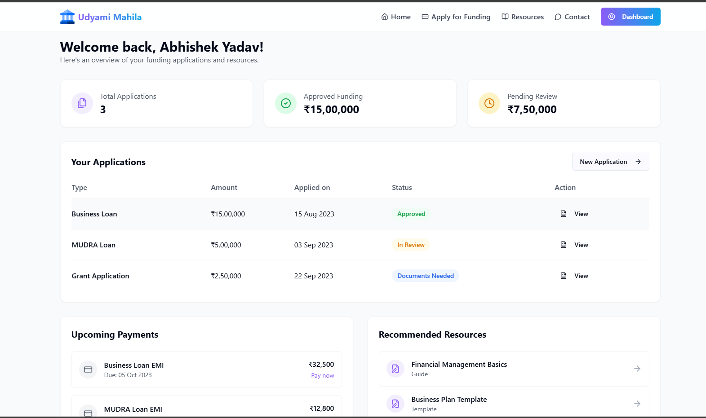
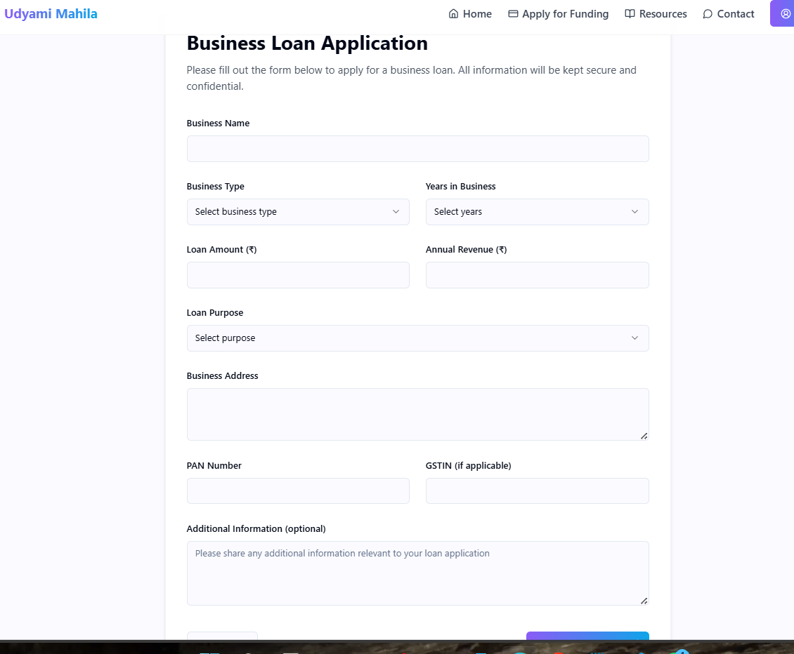
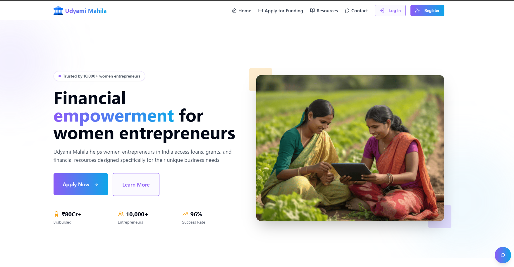
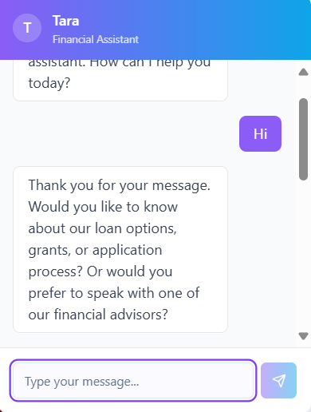

<div align="center">

  <h1>Women-Led MSME Growth Platform</h1>

  <p>
    A robust digital ecosystem designed to empower Women-Led Micro, Small, and Medium Enterprises (MSMEs) by dismantling barriers to market access and fostering sustainable growth.
  </p>

  <p>
    
    
    
    
    
  </p>
</div>

---

### **Table of Contents**
- [About The Project](#about-the-project)
- [Key Features](#key-features)
- [Built With](#built-with)
- [Getting Started](#getting-started)
  - [Prerequisites](#prerequisites)
  - [Installation & Setup](#installation--setup)
- [Contributing](#contributing)
- [License](#license)
- [Contact](#contact)

---

## **About The Project**

The **Women-Led MSME Growth Platform** is a strategic initiative to bridge the gap between women entrepreneurs and the broader market. Traditional business landscapes often present significant hurdles for MSMEs, particularly in supply chain integration and digital visibility. This project directly addresses these challenges by providing a centralized platform that enhances connectivity, simplifies access to procurement systems, and enables a powerful e-commerce presence.

Our goal is to create a self-sustaining ecosystem where technology serves as the primary catalyst for growth, ensuring that women-led businesses can not only compete but thrive in the digital economy.

---

## **Key Features**

<table>
  <tr>
    <td width="50%" valign="top">
      <h3>Dynamic & Intuitive Dashboard</h3>
      <p>A clean, user-friendly interface serves as the central hub for managing all business growth activities, from supply chain connections to tracking market performance.</p>
    </td>
    <td width="50%">
      
    </td>
  </tr>
  <tr>
    <td width="50%" valign="top">
      <h3>Simplified Funding & Procurement Access</h3>
      <p>Streamlined forms and processes make it easier for businesses to apply for funding opportunities and participate in complex procurement systems, breaking down bureaucratic barriers.</p>
    </td>
    <td width="50%">
      
    </td>
  </tr>
  <tr>
    <td width="50%" valign="top">
      <h3>Enhanced Digital Visibility</h3>
      <p>The platform provides tools to build a strong online presence, connecting businesses with a wider audience and integrating them into larger, more stable supply chains.</p>
    </td>
    <td width="50%">
      
    </td>
  </tr>
  <tr>
    <td width="50%" valign="top">
      <h3>Instant Information via AI ChatBot</h3>
      <p>An integrated chatbot provides immediate answers to common questions regarding platform features, market opportunities, and support, ensuring users are never without guidance.</p>
    </td>
    <td width="50%">
      
    </td>
  </tr>
</table>

---

## **Built With**

This project leverages a modern and scalable technology stack to deliver a seamless user experience.

| Frontend | Backend | Database & Services |
| :--- | :--- | :--- |
|  |  |  |
|  | |  |
|  | |  |

---

## **Getting Started**

To get a local copy up and running, please follow these steps.

### **Prerequisites**

Ensure you have the following software installed on your machine:
* [Node.js](https://nodejs.org/) (which includes npm)
* [Go](https://golang.org/doc/install)
* [Git](https://git-scm.com/)

### **Installation & Setup**

1.  **Clone the Repository**
    ```sh
    git clone [https://github.com/utkarsh-deployes/Udyami-Mahila-HackathonProject.git](https://github.com/utkarsh-deployes/Udyami-Mahila-HackathonProject.git)
    cd Udyami-Mahila
    ```

2.  **Install Frontend Dependencies**
    ```sh
    npm install
    ```

3.  **Configure Environment Variables**
    Create a `.env` file in the root directory and add your Firebase project credentials.
    ```env
    VITE_FIREBASE_API_KEY=your_api_key
    VITE_FIREBASE_AUTH_DOMAIN=your_auth_domain
    VITE_FIREBASE_PROJECT_ID=your_project_id
    VITE_FIREBASE_STORAGE_BUCKET=your_storage_bucket
    VITE_FIREBASE_MESSAGING_SENDER_ID=your_messaging_sender_id
    VITE_FIREBASE_APP_ID=your_app_id
    ```

4.  **Run the Frontend Development Server**
    ```sh
    npm run dev
    ```

5.  **Run the Backend Server**
    In a separate terminal, navigate to the backend directory and start the Go server.
    ```sh
    # Assuming the backend is in a 'backend' folder
    cd backend
    go run main.go
    ```

---

## **Contributing**

Contributions are what make the open-source community such an amazing place to learn, inspire, and create. Any contributions you make are **greatly appreciated**.

If you have a suggestion that would make this project better, please fork the repo and create a pull request. You can also simply open an issue with the tag "enhancement".

1.  Fork the Project
2.  Create your Feature Branch (`git checkout -b feature/AmazingFeature`)
3.  Commit your Changes (`git commit -m 'Add some AmazingFeature'`)
4.  Push to the Branch (`git push origin feature/AmazingFeature`)
5.  Open a Pull Request

---

## **License**

Distributed under the MIT License. See `LICENSE` for more information.

---

## **Contact**

Utkarsh - Contributer
Abhishek - Contributer

<p>
  <a href="mailto:utkarsh.cloudops@gmail.com"></a>
  <a href="#"></a>
  <a href="#"></a>
</p>